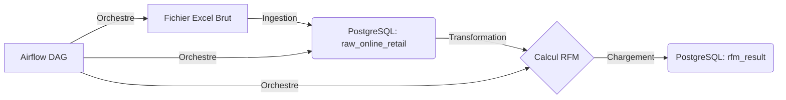

# 🚀 Pipeline de Données RFM (Docker & Airflow)

> **Statut** : Production Ready  
> **Contexte** : Projet pédagogique Ingénieur Data (Bac+5)  
> **Auteur** : David Brimeux

## Description

Ce projet implémente un pipeline **ETL (Extract, Transform, Load)** complet et automatisé pour la segmentation client selon la méthode **RFM** (Récence, Fréquence, Montant).

L'objectif est de démontrer la maîtrise de l'orchestration de données avec **Apache Airflow**, de la conteneurisation avec **Docker**, et du traitement de données avec **Python** et **PostgreSQL**. Le pipeline transforme un fichier brut de ventes (Excel) en une table de scores clients exploitable pour le marketing.

### Points Forts de l'Architecture
- **100% Reproductible** : Configuration externalisée dans `docker-compose.yml` (variables d'environnement `AIRFLOW_VAR_*`).
- **Zéro Intervention Manuelle** : Création automatique de l'utilisateur admin et des variables au premier lancement.
- **Robuste** : Mécanisme de `retries` automatiques et gestion d'erreurs détaillée.
- **Documenté** : Documentation intégrée directement dans l'interface Airflow (`doc_md`).


## Stack Technique

| Composant | Technologie | Rôle |
| :--- | :--- | :--- |
| **Orchestration** | Apache Airflow 2.7.3 | Planification et exécution des tâches ETL |
| **Base de Données** | PostgreSQL 13 | Stockage des données brutes et résultats RFM |
| **Conteneurisation** | Docker & Docker Compose | Isolation et déploiement de l'infrastructure |
| **Traitement** | Python 3.8 (Pandas, SQLAlchemy) | Logique métier d'ingestion et de calcul RFM |
| **Source de Données** | Excel (Online Retail II) | Dataset historique des ventes (UCI Repository) |


##  Démarrage Rapide 

Grâce à l'automatisation mise en place, le déploiement tient en **une seule commande**.

### 1. Prérequis
Assurez-vous d'avoir installé :
- [Docker Desktop](https://www.docker.com/products/docker-desktop)
- Git

### 2. Cloner le projet
```bash
git clone https://github.com/DBX-76/data-pipeline-rfm.git
cd data-pipeline-rfm
```

## 3. Préparer les données

Téléchargez le dataset **Online Retail II** (fichier Excel `.xlsx`) et placez-le dans le dossier `data/` à la racine du projet. Le fichier doit être nommé : online_retail_II.xlsx.

**Note** : Le fichier Excel est ignoré par Git (présent dans `.gitignore`) pour éviter de versionner des données lourdes. Vous devez le télécharger manuellement.


## 4. Lancer l'infrastructure

```bash
docker-compose up -d
```

> **Patience :** Le premier démarrage peut prendre 2 à 3 minutes le temps qu'Airflow initialise sa base de données et crée l'utilisateur admin automatiquement.


## 5. Accéder à l'interface

Ouvrez votre navigateur sur : [http://localhost:8080](http://localhost:8080)

| Champ    | Valeur  |
|----------|---------|
| Username | `admin` |
| Password | `admin` |

> Ces identifiants sont créés automatiquement au premier lancement via le script d'init.


## 6. Architecture du Projet

Le pipeline suit un flux linéaire orchestré par Airflow :



### Structure des dossiers

```
.
├── dags/                  # Workflows Airflow (rfm_pipeline.py)
├── scripts/               # Logique métier Python (ingestion.py, transformation.py)
│   └── requirements.txt   # Dépendances Python
├── data/                  # Données sources (à ajouter manuellement : online_retail_II.xlsx)
├── logs/                  # Logs générés par Airflow
├── docker-compose.yml     # Configuration de l'infrastructure et variables env
├── .gitignore             # Règles d'exclusion (ex: *.xlsx, *.log)
└── README.md              # Ce fichier
```


## 7. Configuration et Variables

Contrairement à une approche classique où les variables sont créées manuellement dans l'UI, ce projet utilise des **variables d'environnement Docker** pour une reproductibilité totale.

Elles sont définies dans `docker-compose.yml` avec le préfixe `AIRFLOW_VAR_` :

| Variable Clé       | Valeur par défaut                              | Description                          |
|--------------------|------------------------------------------------|--------------------------------------|
| `rfm_excel_path`   | `/opt/airflow/data/online_retail_II.xlsx`      | Chemin du fichier source dans le conteneur |
| `rfm_raw_table`    | `raw_online_retail`                            | Nom de la table de données brutes    |
| `rfm_result_table` | `rfm_result`                                   | Nom de la table de résultats RFM     |

> 💡 **Avantage :** Pour modifier le chemin d'un fichier ou le nom d'une table, il suffit de changer cette ligne dans le YAML et de redémarrer les conteneurs. Aucun code Python n'est à modifier.


## 8. Détails du Pipeline (DAG)

Le DAG `rfm_data_pipeline_pro` contient deux tâches principales :

### `ingestion_donnees_brutes`
- Lit le fichier Excel (fusion des 2 feuilles annuelles).
- Nettoie les colonnes et supprime les lignes sans `CustomerID`.
- Charge les données dans la table `raw_online_retail`.

### `transformation_rfm`
- Lit les données brutes.
- Filtre les retours marchandises (quantités/prix négatifs).
- Calcule pour chaque client :
  - **Récence** : Jours depuis le dernier achat.
  - **Fréquence** : Nombre de commandes distinctes.
  - **Monetary** : Chiffre d'affaires total généré.
- Sauvegarde le résultat dans `rfm_result`.

> 📖 **Documentation Intégrée :** Une description détaillée est disponible directement dans l'onglet "Documentation" de l'interface Airflow.


## 9. Commandes Utiles

| Action                        | Commande                    |
|-------------------------------|-----------------------------|
| Voir les logs en temps réel   | `docker-compose logs -f`    |
| Arrêter l'infrastructure      | `docker-compose down`       |
| Reset Total (Effacer DB & Logs) | `docker-compose down -v`  |
| Vérifier l'état des conteneurs | `docker-compose ps`        |


## 10. Business Intelligence & Visualisation (Metabase)

Pour valoriser les données produites par le pipeline, nous avons intégré **Metabase**, un outil de BI open-source. Il se connecte directement à la base `postgres-business` pour permettre l'analyse visuelle des segments clients sans écrire de code SQL.

### Démarrage de Metabase

Le service est inclus dans le `docker-compose.yml`. Il se lance automatiquement avec le reste de l'infrastructure :

```bash
docker-compose up -d metabase
```

> **Premier démarrage :** Metabase peut prendre 2 à 3 minutes pour initialiser sa base de données interne (SQLite).

---

###  Configuration Initiale (À faire une seule fois)

Contrairement à Airflow, Metabase nécessite une configuration manuelle via son interface web au premier lancement.

**1. Accès à l'interface**

Ouvrez votre navigateur sur : [http://localhost:3000](http://localhost:3000)

**2. Création du compte Admin**

Remplissez le formulaire avec vos coordonnées (exemple) :
- **Email :** `admin@rfm-project.com`
- **Mot de passe :** `admin` (ou votre choix)

> **Note :** Ces informations sont stockées localement dans la base SQLite interne de Metabase.

**3. Connexion à la Base de Données RFM**

Une fois connecté, cliquez sur **Settings (⚙️) > Admin > Databases > Add database**. Remplissez les champs avec les paramètres Docker suivants :

| Paramètre       | Valeur à saisir    |
|-----------------|--------------------|
| Display name    | `Projet RFM`       |
| Database type   | `PostgreSQL`       |
| Host            | `postgres-business`|
| Port            | `5432`             |
| Database name   | `rfm_db`           |
| Username        | `rfm_user`         |
| Password        | `rfm_password`     |
| SSL             | ❌ Désactivé       |

Cliquez sur **Save**. Vous pouvez maintenant interroger la table `rfm_result` 


### Choix d'Architecture : Pourquoi SQLite ?

Pour ce projet, Metabase est configuré pour stocker ses propres métadonnées (utilisateurs, réglages) dans une base **SQLite interne** plutôt que dans une base PostgreSQL dédiée.

- **Avantage :** Simplifie considérablement l'architecture Docker (moins de services, moins de risques de conflits de connexion au démarrage). Idéal pour un environnement de développement ou un POC.
- **Perspective Production :** Dans un environnement de production, il serait recommandé de configurer Metabase avec une base PostgreSQL dédiée pour assurer la haute disponibilité, les sauvegardes centralisées et le travail collaboratif multi-utilisateurs.
`


## 11. Licence

Distribué sous la licence **MIT**. Voir `LICENSE` pour plus d'informations.